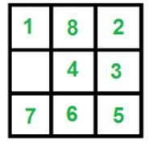

<html>

<head>
<meta http-equiv=Content-Type content="text/html; charset=windows-1252">
<meta name=Generator content="Microsoft Word 15 (filtered)">

</head>

<body lang=EN-US link="#0563C1" vlink="#954F72">

<b>Tile
Puzzle Solver</b>

&nbsp;

Implementation
Of different algorithms to find a solution for the logic <a
href="https://en.wikipedia.org/wiki/Sliding_puzzle">Sliding Puzzle</a>.

Finds a
solution for N x N configurations or N x M configurations, will find the
optimal solution if one of the A* algorithms are used. 

Includes the
L shaped knights chess move for non-blank tiles to increase the problem space. 

Requires the
user to input comma separated values of the board to solve. For example:

The N x N board above will be as stated as being 3 , 3 when
program prompts for the board dimensions and tile positions will be: <b> 1, 8, 2, 0, 4, 3, 7, 6, 5 .</b>

Tool will return a board Equivalent to your board in
ascending order, so for the board above it will try to find a board equal to <b>1 ,2, 3, 4, 5, 6, 7, 8 </b> .
The zero/blank tile could be anywhere in solution but the board will be in
ascending order.

The Blank tile must be represented by a zero.

<b>The tool
assumes that the input configuration will have all the numbers in a given range
present with zero as the blank tile. </b>

<b>For
example a 2x2 board would not work with this tool for inputs 1,0,3,4. The
inputs solution should have each value i being 1 less than the next value in
the solution excluding the zero tile. Like this: 1,0,2,3.   </b>

&nbsp;

Algorithms 

·&nbsp;&nbsp;&nbsp;&nbsp;&nbsp;&nbsp;&nbsp;&nbsp;
Bread First
Search

·&nbsp;&nbsp;&nbsp;&nbsp;&nbsp;&nbsp;&nbsp;&nbsp;
Depth First
Search

·&nbsp;&nbsp;&nbsp;&nbsp;&nbsp;&nbsp;&nbsp;&nbsp;
A* with hamming
distance as a heuristic

·&nbsp;&nbsp;&nbsp;&nbsp;&nbsp;&nbsp;&nbsp;&nbsp;
A* with number of
reversal tiles (If two tiles are next to each other, and the goal requires
their position to be swapped) as a heuristic.

·&nbsp;&nbsp;&nbsp;&nbsp;&nbsp;&nbsp;&nbsp;&nbsp;
A* with average
of the previous two heuristics as its heuristic

&nbsp;

<b>How to
Run:</b> 

Jar is
provided BridgeTorchSolver.jar

Open a
terminal/command prompt in directory and enter

java -jar TilePuzzleSolver.jar

&nbsp;

Then follow
the prompts J

&nbsp;

</body>

</html>
